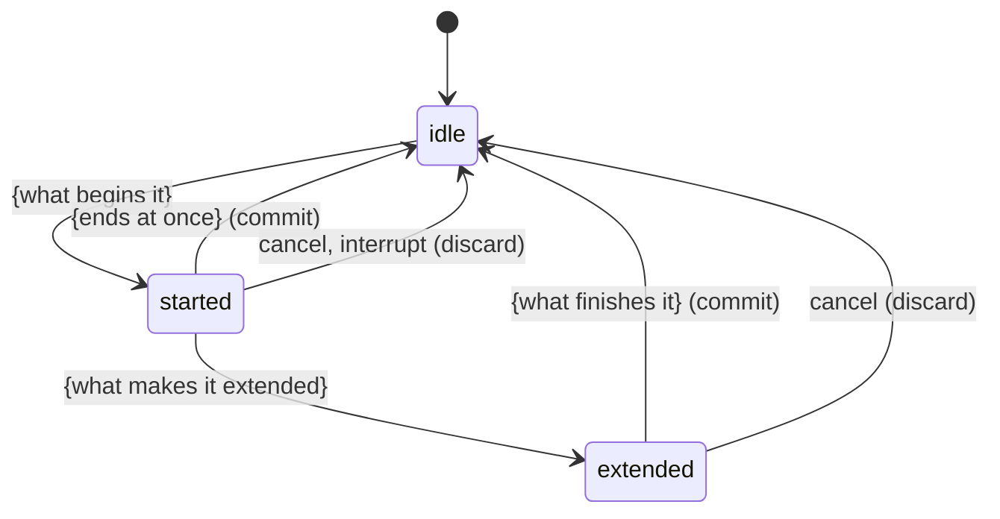

# Feature document template

Every feature document (a tool, a screen, a form, a command, an action, a kind of turn) uses all eight sections. Foundations, UI, and cross-cutting documents may drop sections that do not apply (a settings panel has no extended phase; a static page has no variants) but must still cover interrupt behavior wherever an interaction exists. The pilot document is the complete instance every other document copies. A small feature done properly runs around 150–200 lines; the hardest documents run 250–300.

Headings are sentence case. The H1 is "The {feature}" for tools, screens, and UI ("The invite form", "The toolbar", "The composer"), the bare noun or command for objects, actions, and commands ("Attachment", "Clipboard", "`init`"), and a descriptive phrase for cross-cutting concerns ("Unsaved changes", "Offline", "Configuration precedence").

Section 3's five subsections are the phases of the product's unit of interaction, decided once in Phase 0 (see `product-kinds.md`): **starting**, **ending at once**, **becoming extended**, **while extended**, and **finishing**. Rename the subsection headings to the product's own words for those phases (for a form: arrive / leave untouched / begin editing / while editing / submit; for a command: invoke / exit immediately / begin running / while running / finish; for a gesture: press / release without dragging / begin dragging / while dragging / release) and keep the same five slots in the same order in every document.

---

# The {feature}

## Summary

One paragraph, abstract: what the feature is and what it lets the user do. Then the concrete identity in one or two sentences: where it lives (which screen, menu, or command), how it is reached (a shortcut, a button, a route, a subcommand), what signals that it is active, and whether it is available in restricted states (readonly, a lesser role, offline, a pipe instead of a terminal).

## The simple case

The common path in prose, two to four short paragraphs. No variants, no edge cases. What the user does and what they see. Note whether the feature stays active afterwards or returns to a default, and where the user lands.

## The interaction, event by event

Only the states the user passes through, named in the product's words (`viewing`, `dirty`, `submitting`, `saved`; `parsing`, `running`, `done`, `failed`; `composing`, `waiting`, `streaming`, `complete`; `pointing`, `dragging`). Omit internal bookkeeping states. Label every transition with what triggers it and, in parentheses, what it commits or discards.

### {Starting}

What begins the interaction and what is decided at that instant: what is targeted and how the target is chosen, what is loaded, focused, or prefilled, what is validated before anything runs, what is captured or snapshotted so it can be restored. What changes visibly right away. Which variant, if set *at* the start, changes the outcome.

### {Ending at once}

The short path: the interaction ends before it becomes extended (a click without a drag, a page left untouched, `--help` or a usage error, an empty message). What, if anything, is committed or recorded; whether it can be undone; what the feature does next (stays active, returns to a default). Say explicitly when nothing is recorded; "nothing" is a claim the tester can check.

### {Becoming extended}

What crosses the line from the short path to the long one (a distance or time threshold, the first edit that makes the form dirty, the first side effect after which aborting is no longer free, the moment a message is committed to history). What is decided at that instant and fixed for the rest of the interaction (the anchor, the original values, the set of things that will be affected). What visual or output begins.

### {While extended}

What updates continuously and how the live result is computed in user terms (the thing follows the input by the offset it was grabbed at; validation runs on each keystroke but errors show on blur; progress is reported per file; the response streams token by token). What is cumulative and what is recomputed from scratch. What the user can still do meanwhile and what is disabled.

### {Finishing}

What is committed, as how many undo steps or which durable records or files. Side effects the user would notice (a notification is sent, a container takes its children with it, a lockfile is written, a draft is cleared). What the feature does next and where the user lands. The failure path, if the commit can fail: what is shown, what is kept, what is rolled back.

## Modifiers

| Modifier | Set at the start | Changed while extended |
| --- | --- | --- |
| {variant 1} | | |
| {variant 2} | | |
| {variant 3} | | |
| {variant 4} | | |

The rows are the product's variant axis from Phase 0 (modifier keys; the user's role and the record's state; flags, environment, and whether output is a terminal; the selected mode, attachments, and conversation state) and are the same rows in every document. Every cell filled, "No effect." where that is the answer. A sentence after the table on what changing a variant mid-interaction does (pressing or releasing a key, a role change taking effect, a flag that cannot change once running).

## Cancel and interrupt

| Event | {Before extended} | {While extended} |
| --- | --- | --- |
| {The user's explicit abort: Escape, Stop, Ctrl+C, Cancel} | | |
| {The user doing something else mid-way: switching tools, modes, tabs, or conversations; navigating; sending another message} | | |
| {The events the product treats as a clean "complete": a menu opening, undo or redo, a submit from elsewhere} | | |
| {The environment failing: window loses focus, network lost, request fails or times out, session expires, process killed} | | |
| {The page or process going away: reload, tab closed, terminal closed, app backgrounded} | | |
| {Something else changing the target: deleted, locked, moved, edited by another user or tab, changed on disk} | | |
| {The input channel changing: a second input device, autofill, a pipe closing, touch cancel} | | |
| {Any product-specific mode that changes what happens after the interaction} | | |

The rows are the product's interrupt list from Phase 0. They are the same rows in the same order in every document in the repo; rewrite them once for the product and then never vary them. The columns are the interaction's phases before and after it became extended. Every cell filled. Follow with a sentence or two on what happens *after* the interrupt (does the user stay in the feature or return to the default? is a draft kept? is partial work left on disk?) and a `> Technical note:` only if the mechanism produces a result the user would not expect.

## Interactions with other systems

One bold-led paragraph per cross-cutting concern, in the same order in every document: **{Permissions.}** **{History or undo.}** **{Containers or parents.}** **{Locked or readonly state.}** **{Offline and reconnection.}** **{Collaboration or multi-device.}** **{Notifications.}** **{Configuration and preferences.}** and whatever else the product has. The list and its order come from Phase 0. Include a concern even when the answer is "no interaction"; it is one line and it tells the reader the question was asked.

## Edge cases

A bullet list. Anything a user could notice that the sections above do not cover: overlapping or ambiguous targets, boundaries and limits (maximum size, count, length), nesting, the interaction started one way and finished another, repeated or double invocation, order-dependent outcomes, empty states, the very first and very last instance of something.

## Open questions and verification

- What was read from code but not confirmed by hand, one bullet each.
- Behavior that looks like a bug, stated as such: "may be worth treating as a bug rather than documenting."
- Assumptions the document rests on.

Verified against {source repo} commit `{short sha}`.
